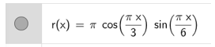
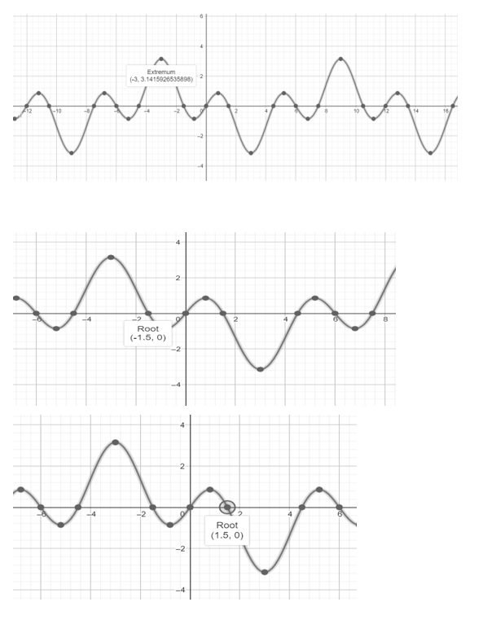
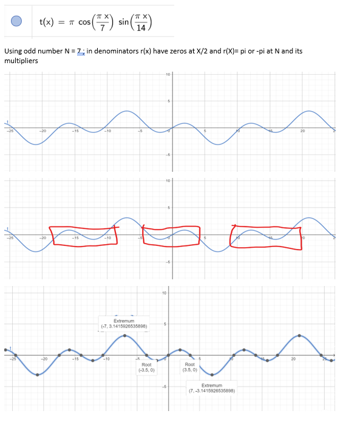
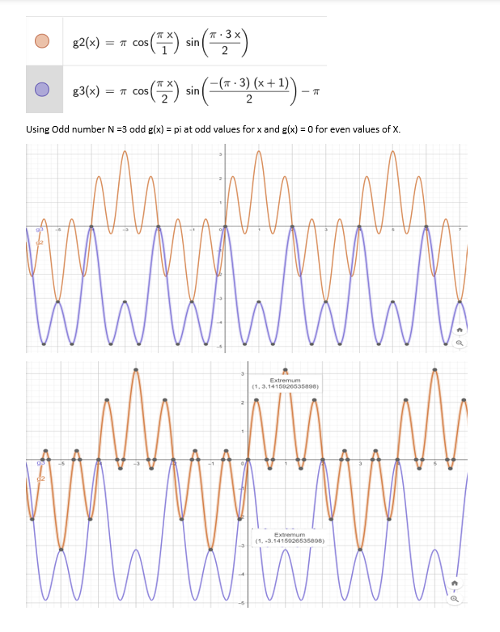
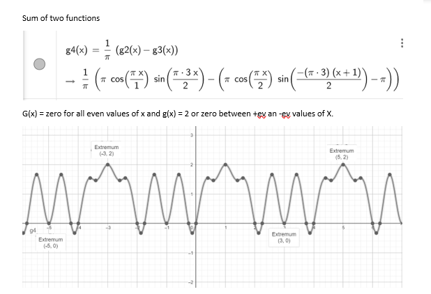

# SinXCosXFunctions
* Sin and Cos Synchronization
* Sin(X) and Cos(X) Eigen Characteristics
* Find X For Cos(Sin(x))=1/2  ?
* Pi and Sin and Cos
* Square root and Sin and Cos

  ------
* Sin and Cos Synchronization
  ---

* Sin(X) and Cos(X) Eigen Characteristics
  ---

* Find X For Cos(Sin(x))=1/2  ?
  ---

 

* Pi and Sin and Cos
  ---

* Square root and Sin
  ---

